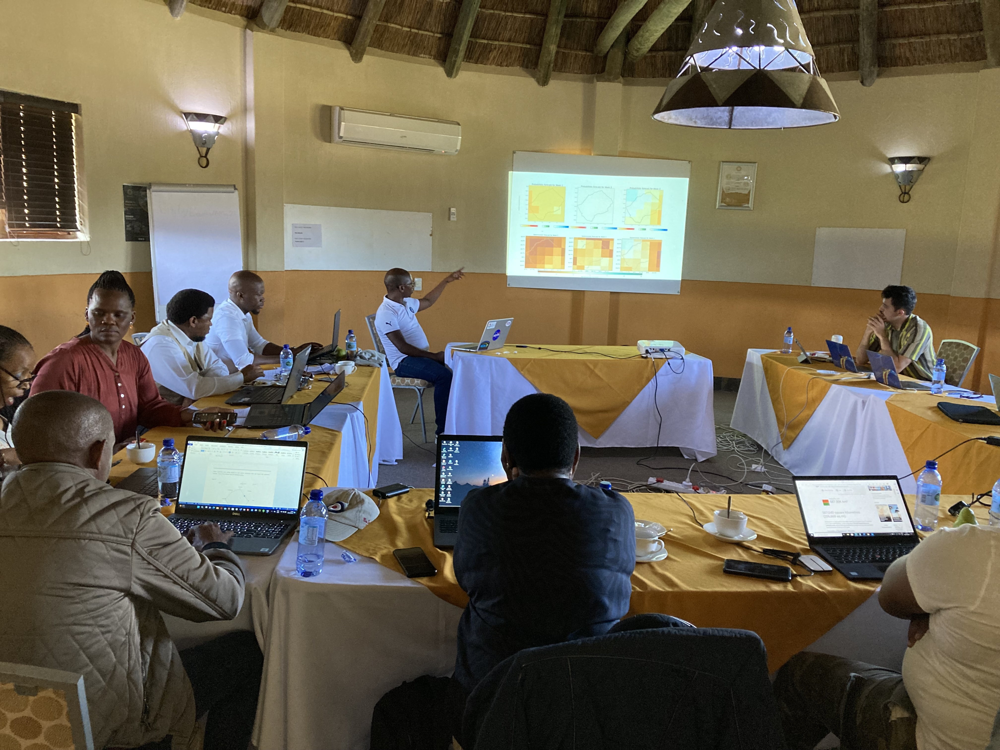
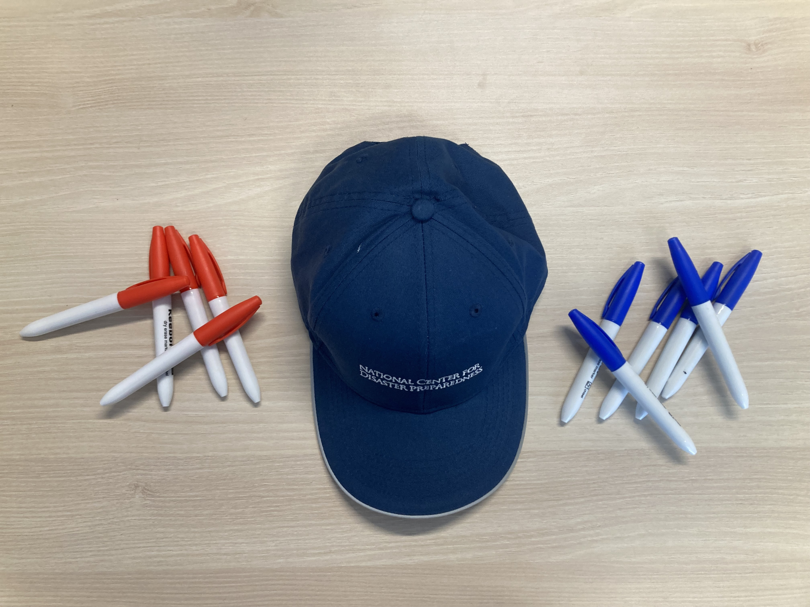
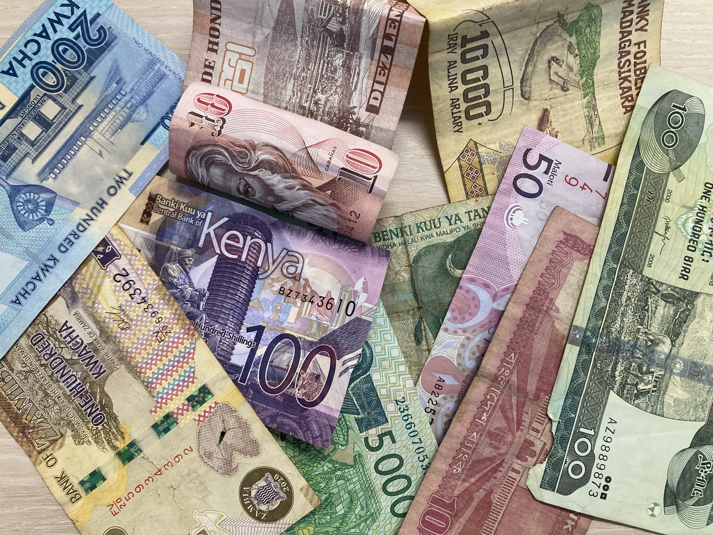
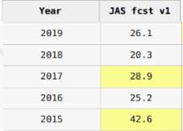
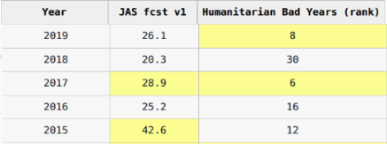
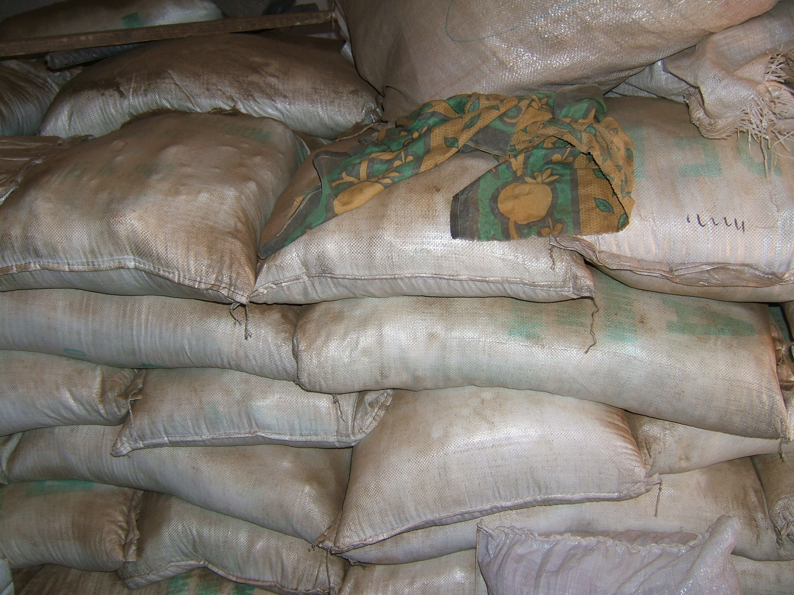
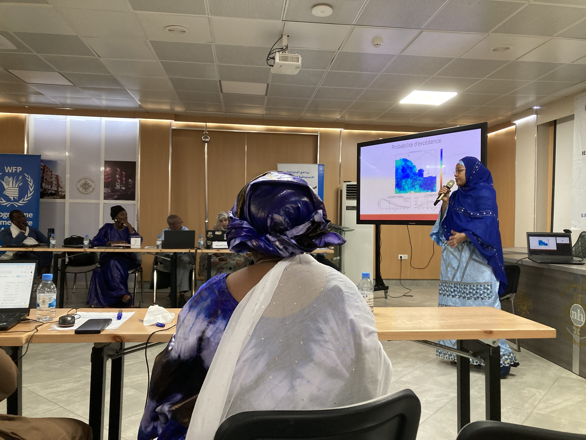
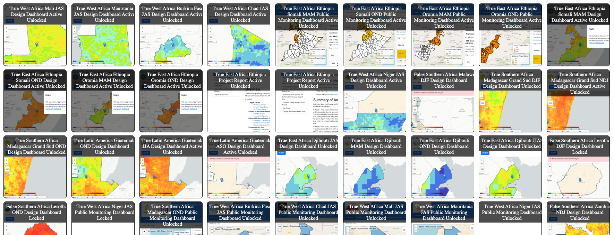

# Anticipatory Action Decisions: Printable Edition

*Generated by following the repository's `data-next` navigation chain.*

Page 1 of 16 · Source: <code>index.md</code>

# Imagining Anticipatory Action

Last updated: 
Tue Jan 27 16:11:20 EST 2026

In this exercise you will imagine you are a disaster decisionmaker 
thinking about if it is possible to use forecasts to make disaster preparedness actions.

It is intended to introduce you to key concepts, terms, analysis, and trade-offs for Anticipatory Action projects.  

Enter your email to proceed (or any nickname to keep your comments organized):

<strong>Interactive response form</strong> Interactive form omitted from printable edition.

Page 2 of 16 · Source: <code>disastermandate.md</code>

# Disaster Probabilities

## You are a national disaster manager.  

**Your mandate is to take action to reduce the impacts of droughts on people.**

Some of the actions in your portfolio are:

- Delivering food 

- Delivering drought tolerant seeds

The agricultural season is when most of the food that people eat is produced. It is roughtly July, August, September (JAS). 
Your agency is required to act if the number of food insecure people rises above officially defined levels.  Your agency uses an official Integrated Food Security Phase Classification (IPC) that reports how many food insecure people there are at the end of the year in December.  

Below is the food security data available.

## Food Insecurity by Year

| Year | IPC-Number of Food Insecure People |
|----------|----------|
2019 | 41,685 |
2018 | 11,898 |
2017 | 53,421 |
2016| 24,344 |
2015 | 32,423 |

## Your agency has two official requirements in place.

### Rule 1. Extreme drought: You must take action if there are more than 50,000 food insecure people

### Rule 2. Moderate drought: You must take action if there are more than 40,000 food insecure people

Lets warm up with some practical and slightly tedious questions before getting to the challenging ones 
requiring your professional judgement and official mandates and responsibilities.

Take a look at the IPC table and your rules for action.  
Look at what years exceed or fall below the thresholds for action, and then answer the following questions.

<strong>Interactive response form</strong> Interactive form omitted from printable edition. Kobo form ID: <code>0Wz0B9Wl</code>

Page 3 of 16 · Source: <code>probabilityanswers.md</code>

# Disaster Mandate Answers 

- Rule 1 response years: 2017

- Rule 2 response years: 2019, 2017

- Number of years for Rule 1: 1

- Number of years for Rule 2: 2

- Fraction for Rule 1: 1/5

- Fraction for Rule 2: 2/5

- Percentage for Rule 1: 20%

- Percentage for Rule 2: 40%

- What if you diddnt have IPC: You could identify the number of drought years you would have liked to or would have needed to act in the past several years.  If you can rank which year would have been more important to act, you would be able to choose what to do if your ability to act is constrained.

Page 4 of 16 · Source: <code>aahat.md</code>

# Probability drills

## Imagine you have a hat

Let's build some intuition about the probabilities that result from your disaster mandate, and the historical information.

Imagine you have a hat, and several markers.  

- Some of the markers are red, and represent disaster action years

- Some of the markers are blue, and represent non-action years

You will be drawing from a hat to simulate disaster action.

You are allowed to put 5 markers in the to represent the probabilities of action.  

Prepare yourself, and then fill out the form below

<strong>Interactive response form</strong> Interactive form omitted from printable edition. Kobo form ID: <code>dNdbr6or</code>

Page 5 of 16 · Source: <code>aahatanswers.md</code>

# AA Hat Answers 

- Rule 1 red markers: 1

- Rule 1 blue markers: 4

- Rule 2 red markers: 2

- Rule 2 blue markers: 3

- Number of actual draws depends on what happens in the simulation

- Red drawn on average: 1

- Is the number equal--depends on what happened in the simulation

- Should it be exactly the same: Not necessarily (but it is possible)

- What does this mean:  We are only approximating frequency and probabilities by looking at a short number of draws, which can lead to errors

- What can we do: If we only have a short number of years, we can work to put bounds on the levels of errors that exist, and try to design programs that are robust to these errors.

- Do we need to be careful:  YES!

Page 6 of 16 · Source: <code>budgets.md</code>

# Budget Constraints

# Imagine that your funding has limits...

Now lets play two roles.

1) The Actor = the disaster manager

- The Actor is asked to do Rule 2, which is action 40% of the years.

- The action costs **$1,000,000 per year activated**

2) The funder = the government budget agency or external donor

- The funder has a 5 year budget cap of $1.5 million

Roleplay and go through the questions below...

<strong>Interactive response form</strong> Interactive form omitted from printable edition. Kobo form ID: <code>hACTMCaZ</code>

Page 7 of 16 · Source: <code>budgetanswers.md</code>

# Budget Answers 

- Two million would be needed for the actor over the 5 years

- The actors can fund 1.5 actions, or 30% frequency

- No the funder cannot fund the rate of 40% actions that the actor would like to take but can only fund 30%

- Negotiated rate depends on the simulation players

- Do we need to be careful:  YES!

Page 8 of 16 · Source: <code>forecast.md</code>

# Forecasts 

Now imagine that it is possible for the Met office to make a forecast available in April that tries to predict if the July-August-September agricultural season will be a drought.

You can look at the table above to see an actual example of this kind of forecast.  The forecast column lists the probability of drought, a higher number means a higher probability of drought.  

We can invert the math for when we would act to see how to use the forecast.   
The questions will walk you through that process.

<strong>Interactive response form</strong> Interactive form omitted from printable edition. Kobo form ID: <code>cD8vUEdF</code>

Page 9 of 16 · Source: <code>forecastanswers.md</code>

# Forecast Answers 

- Which year has the highest probability of drought? Answer: 2015

- Which year has the second highest probability of drought? Answer: 2017

- If you had a mandate to act 40% of the time, which two years would the forecast say to act? Answer: 2025, 2017

- Are those years shaded yellow to make our next discussion points more convenient? Answer: yes

- If we were to pick a forecast level that is strong enough to meet the 40% criteria, for which 2 years are at or above that level and the rest of the years are below that level, how high would it need to be? Answer: 28.9, or the smallest of the two years that qualify.

- That forecast level is called the trigger threshold for April.  If we set a policy that action is triggered if the forecast is at or above that threshold, what percentage of the time do we trigger action? Answer: 40%

- Does the forecast always correctly predict what will actually happen? Answer: No, of course not.  It is science, not magic!

Page 10 of 16 · Source: <code>forecasterror.md</code>

# Forecast Error 

The humanitarian events are now listed in the figure alongside the forecasts.  
They are presented in terms of rank, 
the year with the highest number of food insecure people is ranked 1, 
and the second highest number is 2, and so on.  

This table is only a snippet of a much longer table that you will see in future steps.  The longer table extends from 2000-2024, the worst years. The worst year, through the 5th worst year did happened 
in years other than 2015-2019, so the worst year in the table 
starts with the number 6.

<strong>Interactive response form</strong> Interactive form omitted from printable edition. Kobo form ID: <code>tqCQbw3Z</code>

Page 11 of 16 · Source: <code>forecasterroranswers.md</code>

# Forecast Error Answers

- Could you use the forecast to take action months before the drought starts? Answer: Yes

- Would that give you more time to prepare? Answer: Yes

- Could that reduce the negative impacts of drought on people? Answer: Yes

- What might be the problem with using the forecast? Answer: It might be wrong

- Which year is the worst humanitarian event in the table? Answer: 2017

- Did the April forecast trigger in that year? Answer: Yes, this is called worthy action

- What is the second worst humanitarian event in the table? Answer: 2019

- Did the April forecast trigger in that year? Answer: No, this is called fail to act.

- What is the 3rd worst humanitarian year?  Answer: 2015

- Does this year count as a year you would have needed to act using rule 2? Answer: No

- Does the forecast trigger for that year?  Answer: Yes, this is called fail to act.

- What are your thoughts about if you would accidentally act in a year that was bad, but not so bad that action was required by official mandate? Answer: You know best

- Could increasing frequency prevent failure to act?  Answer: Yes

- Could increasing frequency cause more actions in vain?  Answer: Yes

- Does the number of humanitarian crises impact the action frequency? Answer: Yes

- Does the action cost and budget impact the action frequency? Answer: Yes

- Does the forecast accuracy impact the action frequency? Answer: Yes

- Do humanitarian actors, funding managers, and forecast scientists all need to work together to determine the best forecast triggers?  Answer: Yes

- Can any of those experts correctly determine triggers without consulting the others? Answer: No

Page 12 of 16 · Source: <code>actiondesign.md</code>

# Action design

You are funded for a 40% action frequency, and are using the forecast triggers of the table above.

Your agency has the following drought action:

## Procure/distribute Drought Tolerant Seeds

- These are quick growing and drought tolerant, but lower yield than the regular high yielding full season seed the farmers usually buy.

- If you fail to act before the season begins and it is a drought, even if you have already procured the seeds you will not have enough time to provide the seeds for the farmers to plant them before the season.  

- If you have not already procured the seeds, you would not be able to take any action with drought tolerant seeds relevant for that growing season.

- If you distribute the seeds and it is not a drought, you would have to use up your budget, and the farmers would have had lower yields with the drought tolerant seed than if they had used high yielding full season seeds. 

- If a drought season begins with the normal, high yielding seeds, there will be a sowing failure, 
	- the only way to get yields is with the drought tolerant seeds
	- Even if they get drought tolerant seeds after the sowing failure, the farmers will have lost lost of money paying the failed high yielding seed costs.

Look at the trigger and action table, remember the accuracy discussions from the previous slide.

Now think about what kinds of choices you are willing to take responsiblity for and answer the questions below:

<strong>Interactive response form</strong> Interactive form omitted from printable edition. Kobo form ID: <code>kAVxpdze</code>

Page 13 of 16 · Source: <code>actiondesignanswers.md</code>

# Action Design Answers

There are no right answers to the questions from most recent forms, there are only challenging tradeoffs that must be made using math and the professional responsabilty and expertise of the action designers and the elected or appointed official who holds responsiblity for action.

# Forecast Trigger Design and Action Design MUST be done together!

Anticipatory action requires a simultaneous solution of multiple equations.  The math is simply incorrect if disaster actors, funding constraints, and climate scientists are not all involved in both parts.

## Action Design Depends On

- budgets

- forecast accuracy

- timelines

- costs

- consequences of action and inaction

- designing fallback options to address errors

# Forecast trigger design depends on

- how often actions need to be taken (disaster frequency)

- budgets

- forecast accuracy

- consequences of action

- consequences of inaction

- what component of the action the specific trigger is activating

## This is not rocket science--it is harder than rocket science, but it is something that we can do a responsible job with if we are careful and thoughtful.

Page 14 of 16 · Source: <code>designtools.md</code>

# Design Tools

Experts in many countries and international organizations are using design tools to work through these questions.  

Similar to designing an airplane, the design tools and adavanced analysis do not simply give the answers, but allow the experts to work together to design something mathematically sound, appropriate, and responsible, based on their expertise and mandates.

Below is an example of a tool to help evaluate a forecast generated by a national met office for different trigger frequencies.  **This was the tool that your exercises used.**  It is a design dashboard that has been used in real projets, that has been locked for consistency in training sessons.

To illustrate some of the points we discussed:

- Do you see 5 year periods with fewer than 2 triggers, more than 2 triggers?

- Drag the "Frequency of trigger events" slider to different frequencies to see the software calculate the different action levels

For more documentation on how this tool works, please see:

French:  https://fist.iri.columbia.edu/publications/docs/WA_AA_General_Material_Update/

English: https://fist.iri.columbia.edu/publications/docs/Djibouti_AA_Tool_Guide/

This tool would be used as part of the process to design actions and triggers.  
Once those are chosen, they are committed to and "frozen" before the forecasts for the coming year start.

Then a separate set of tools are used to moniter the forecasts, triggers, actions, and actual season outcomes.  To see examples of that that click on the next slide button at the bottom of the page.

**IF THE BOX BELOW IS BLANK, PASTE THIS URL INTO AN INCOGNITO WINDOW**

https://iridl.ldeo.columbia.edu/fbfmaproom2/training_dashboard?mode=0&map_column=prcp-v1&season=season1&predictors=prcp-v1+chirps-precip-jas&predictand=bad-years-humanitarian&year=2025&issue_month=apr&start_year=2000&freq=30&severity=0&include_upcoming=false&position=%5B19.25%2C-11.1%5D&show_modal=false

    

<strong>Interactive embedded content</strong> 
This printable edition cannot reproduce the interactive dashboard. 
<a href="https://iridl.ldeo.columbia.edu/fbfmaproom2/training_dashboard?mode=0&amp;map_column=prcp-v1&amp;season=season1&amp;predictors=prcp-v1+chirps-precip-jas&amp;predictand=bad-years-humanitarian&amp;year=2025&amp;issue_month=apr&amp;start_year=2000&amp;freq=30&amp;severity=0&amp;include_upcoming=false&amp;position=%5B19.25%2C-11.1%5D&amp;show_modal=false">https://iridl.ldeo.columbia.edu/fbfmaproom2/training_dashboard?mode=0&amp;map_column=prcp-v1&amp;season=season1&amp;predictors=prcp-v1+chirps-precip-jas&amp;predictand=bad-years-humanitarian&amp;year=2025&amp;issue_month=apr&amp;start_year=2000&amp;freq=30&amp;severity=0&amp;include_upcoming=false&amp;position=%5B19.25%2C-11.1%5D&amp;show_modal=false</a>

Page 15 of 16 · Source: <code>operation.md</code>

# Operational Tools

Here is an example of a dashboard used during the season to monitor triggers and take action!

You can click through and see the state of the forecast, the lists of actions, protocols, and other information relevant to the operation of the system.

**IF THE BOX BELOW IS BLANK, PASTE THIS URL INTO AN INCOGNITO WINDOW**

https://fist.iri.columbia.edu/publications/docs/Madagascar_AA_FLexDashboard_OND_2024_FR/

    

<strong>Interactive embedded content</strong> 
This printable edition cannot reproduce the interactive dashboard. 
<a href="https://fist.iri.columbia.edu/publications/docs/Madagascar_AA_FLexDashboard_OND_2024_FR/">https://fist.iri.columbia.edu/publications/docs/Madagascar_AA_FLexDashboard_OND_2024_FR/</a>

Page 16 of 16 · Source: <code>finished.md</code>

# Anticipatory Action is Scaling

More than ten countries have already used tools like these to design and operate Anticipatory Action projects.  As a farewell, we leave you with a figure with thumbnails of many of the dashboards used.

# Thanks!

